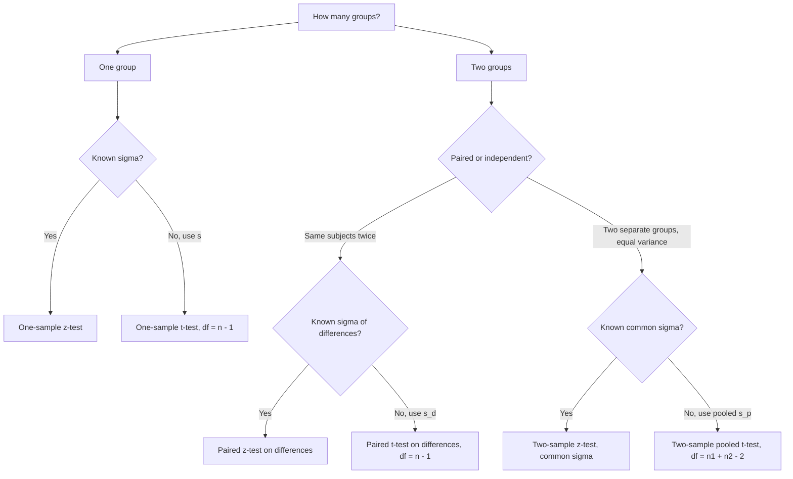

# Notes on inferential statistics (Part 1)






Imagine you are in a courtroom. The judge will listen to the defendant's and witnesses' statements to reach a verdict on whether the defendant is guilty. This is exactly what a hypothesis test is in inferential statistics.

In inferential statistics, we focus on how to use small, representative random samples (such as the witness statements and collected evidence) to make informed predictions about the population as a whole. These predictions can be used to support a new belief or suggest whether an assumption is reasonable.

## Hypothesis Test

In the courts, the defendant is presumed innocent, which means that the default assumption is that the defendant is innocent before evidence is presented.

This default assumption is called the **null hypothesis** ($H_0$). This assumption/belief may or may not be justified by reality, but to determine its validity, the judge examines the evidence collected and the witness statements.

The next step is to present the evidence and let the witnesses describe what happened. If we want to suggest that the defendant is guilty, we have to provide evidence to reject the original null hypothesis. This **alternative hypothesis** is called $H_1$.

Then the judge will consider the evidence and witness statements to determine whether there is enough to convict the defendant, in other words, whether there is enough to reject the original assumption that the defendant is innocent.

## Rejection/Critical Region & Acceptance Region

Back to the courtroom. The judge cannot just say "I feel he is guilty". There has to be a rule agreed beforehand: *what kind of evidence is strong enough to convict?*

That rule divides all possible evidence into two regions:

- **Rejection / Critical Region:** if the evidence falls here, it is too extreme to believe under the assumption of innocence. The judge rejects $H_0$ and convicts.
- **Acceptance Region:** if the evidence falls here, it is still compatible with innocence. The judge does not reject $H_0$ — note we say "fail to reject", not "prove innocent".

The boundary between them is called the **critical value**. Where we draw the line depends on how strict we want to be. That strictness is the **significance level**, denoted $\alpha$.

> In most daily work, $\alpha = 0.05$. It means: we are willing to take a 5% risk of convicting an innocent person (a Type I error). In more serious cases, like medicine or criminal trials, we might use $\alpha = 0.01$ or even smaller.



There are two equivalent ways the judge makes the decision:

1. **Critical value approach:** compute a test statistic from the sample, and see if it falls into the rejection region.
2. **$p$-value approach:** compute how surprising the observed evidence is, assuming $H_0$ is true. If $p \le \alpha$, reject $H_0$.

The **$p$-value** is the probability of seeing evidence *at least as extreme* as what we observed, if the defendant were truly innocent. A tiny $p$-value says: "if he were innocent, what we saw would be almost impossible — so we don't believe he is innocent."

And of course, judges make mistakes. There are two kinds:

- **Type I error:** reject a true $H_0$. Convict an innocent person. Its probability is $\alpha$.
- **Type II error:** fail to reject a false $H_0$. Let a guilty person walk free. Its probability is denoted $\beta$. $1 - \beta$ is called the **power** of the test.

| Reality \ Decision | Fail to reject $H_0$ | Reject $H_0$ |
|---|---|---|
| $H_0$ is true | Correct ($1-\alpha$) | Type I error ($\alpha$) |
| $H_0$ is false | Type II error ($\beta$) | Correct / Power ($1-\beta$) |

## Confidence Interval: How Large Is the Doubt?

So far the judge only gives a yes/no verdict: convict or not. But that is a bit thin. A good judge would also say: "based on the witnesses, I believe the true height is around 175 cm, give or take 3 cm."

That "give or take" range is the **confidence interval (CI)**.

Formally, a $(1-\alpha)\times 100\%$ confidence interval is a range computed from the sample that we use to trap the unknown population parameter (usually the mean $\mu$). Its general shape is always:

$$\text{estimate} \pm \text{(critical value)} \times \text{(standard error)}$$

For example, if $\sigma$ is known, a 95% CI for $\mu$ is $\bar{x} \pm 1.96 \cdot \sigma/\sqrt{n}$. If $\sigma$ is unknown, replace $1.96$ with $t_{n-1,\,0.025}$ and $\sigma$ with $s$. Each $z$-/$t$-test below has a matching CI — just rearrange its test statistic into $\text{estimate} \pm \text{critical} \times \text{SE}$; the full list is summarised in the cheat sheet at the end.



What does "95% confident" actually mean? There are two common slips:

> "Take 100 samples, and 95 times the sample mean falls into the CI." ❌
>
> "There is a 95% probability that the true population mean sits inside this particular interval." ❌

The first reverses the roles. The CI moves with each sample; the true $\mu$ is fixed. The second sounds almost right, but it treats the truth as if it were rolling dice. In the frequentist view, $\mu$ is a fixed (though unknown) number — it either sits inside our computed interval or it doesn't. Once the witnesses have spoken and the interval is on paper, the probability is 0 or 1, just unknown to us.

The correct reading is about the *procedure*, not *this particular* interval:

> If we take 100 different random samples and build 100 CIs, about 95 of those intervals will contain the true population mean $\mu$. ✅

In courtroom words: if 100 different witness groups each give their own "give or take" range, about 95 of those ranges will successfully trap the truth. We just don't know whether *our* one is among the lucky 95 or the unlucky 5.

The CI and the hypothesis test are two sides of the same verdict (this is called **duality**):

- If the claimed value $\mu_0$ falls *inside* the $(1-\alpha)$ CI, the evidence is still compatible with it — fail to reject $H_0$ at level $\alpha$.
- If $\mu_0$ falls *outside* the CI, it is too extreme to believe — reject $H_0$.

So the test says *guilty or not*, while the CI says *how large the effect plausibly is*. Always report both.

With this courtroom procedure in mind, let's meet our first two judges: the $z$-test and the $t$-test.

## Big Picture: $z$-test vs. $t$-test

Both tests are asking about **means** — is the average what we claimed it to be?

The only difference is how much we know about the population:

- **$z$-test:** we *know* the population standard deviation $\sigma$. It's like we already know exactly how reliable our witnesses are. The sampling distribution follows the standard normal $N(0,1)$.
- **$t$-test:** we *don't know* $\sigma$, so we have to estimate it from the sample with $s$. It's like we have to guess witness reliability from the witnesses themselves. This extra uncertainty makes the tails heavier, so we use Student's $t$-distribution instead of the normal.



In practice: large sample + known $\sigma$ → $z$; $\sigma$ unknown → $t$ (even if $n$ is large, $t$ is almost $z$ anyway). Normality of the underlying population is assumed, or, thanks to the Central Limit Theorem, a large enough $n$ (rule of thumb: $n \ge 30$).

Each test below comes in three flavours:

1. **One-sample:** one group vs. a claimed value. "Is this defendant's height really 180 cm?"
2. **Two-sample (independent):** two separate groups. "Do defendants from city A and city B have the same average height?" In this note, we assume both groups share the same variance (pooled version).
3. **Paired:** same subjects measured twice. "Did the same defendant grow taller after one year?" This reduces to a one-sample test on the differences.

## $z$-test: When $\sigma$ Is Known

Assumptions:

- Data are randomly sampled.
- Population is normal, or $n$ is large enough for CLT.
- Population standard deviation $\sigma$ is **known**.

General logic: under $H_0$, construct

$$Z = \frac{\text{(sample estimate)} - \text{(hypothesised value)}}{\text{standard error}} \sim N(0,1)$$

and reject $H_0$ if $Z$ is too far out in the tails.

### 1. One-Sample $z$-test

**Courtroom story:** one witness group claims the average height of a town is $\mu_0$. We measure $n$ random people, get sample mean $\bar{x}$. Is the claim believable?

Hypotheses (two-sided version; one-sided just takes one side):

$$H_0: \mu = \mu_0 \quad \text{vs.} \quad H_1: \mu \ne \mu_0$$

Test statistic:

$$Z = \frac{\bar{x} - \mu_0}{\sigma / \sqrt{n}}$$

Decision at level $\alpha$:

- Two-sided: reject $H_0$ if $|Z| > z_{\alpha/2}$.
- Right-tailed ($H_1: \mu > \mu_0$): reject if $Z > z_{\alpha}$.
- Left-tailed ($H_1: \mu < \mu_0$): reject if $Z < -z_{\alpha}$.

Here $z_{\alpha}$ is the upper-$\alpha$ quantile of $N(0,1)$ (e.g. $z_{0.025} \approx 1.96$).

### 2. Two-Sample $z$-test (Independent, Equal Variance)

**Courtroom story:** two *separate* groups of witnesses, $n_1$ from town A and $n_2$ from town B. Do the two towns have the same mean? We know both towns share the same (known) spread $\sigma$.

Hypotheses (usually $\Delta_0 = 0$):

$$H_0: \mu_1 - \mu_2 = \Delta_0 \quad \text{vs.} \quad H_1: \mu_1 - \mu_2 \ne \Delta_0$$

Test statistic (pooled / common-$\sigma$ version):

$$Z = \frac{(\bar{x}_1 - \bar{x}_2) - \Delta_0}{\sigma \sqrt{1/n_1 + 1/n_2}}$$

The denominator is the standard error of the difference of two independent means. Decision rule is the same as above: compare $|Z|$ (or one-sided $Z$) with $z_{\alpha/2}$ (or $z_{\alpha}$).

> Note: if the two known variances differ ($\sigma_1 \ne \sigma_2$), the denominator simply becomes $\sqrt{\sigma_1^2/n_1 + \sigma_2^2/n_2}$. The equal-variance version here is the special case $\sigma_1 = \sigma_2 = \sigma$.

### 3. Paired $z$-test

**Courtroom story:** the *same* $n$ people are measured twice — before and after. Each pair is linked, so the two samples are not independent. Think of asking the same witness twice.

Trick: reduce it to a one-sample problem. Define differences:

$$d_i = x_{1i} - x_{2i}, \quad \bar{d} = \text{mean of } d_i$$

Let the known standard deviation of the differences be $\sigma_d$. Then test the mean difference $\mu_d = \mu_1 - \mu_2$:

$$H_0: \mu_d = \Delta_0 \quad \text{vs.} \quad H_1: \mu_d \ne \Delta_0$$

$$Z = \frac{\bar{d} - \Delta_0}{\sigma_d / \sqrt{n}}$$

Same rejection rule. Pairing removes the between-person noise, which is why a paired design is often more powerful than two independent samples — the judge hears the *same* witness change their story, rather than comparing two different crowds.



## $t$-test: When $\sigma$ Is Unknown

In real life we rarely know $\sigma$. So we estimate it with the sample standard deviation $s$, and pay the price: the test statistic no longer follows $N(0,1)$, but Student's $t$-distribution with some degrees of freedom ($df$).

Assumptions:

- Random sampling, approximately normal population (more important here than for $z$, especially when $n$ is small).
- $\sigma$ **unknown**, estimated by $s$.

General logic:

$$T = \frac{\text{(sample estimate)} - \text{(hypothesised value)}}{\text{estimated standard error}} \sim t_{df}$$

As $df$ grows, $t_{df} \to N(0,1)$ — with enough witnesses, guessing their reliability hardly matters.

### 1. One-Sample $t$-test

**Courtroom story:** same as one-sample $z$, except we don't know how reliable the witnesses are, so we estimate spread from the sample itself.

$$H_0: \mu = \mu_0 \quad \text{vs.} \quad H_1: \mu \ne \mu_0$$

$$T = \frac{\bar{x} - \mu_0}{s / \sqrt{n}} \sim t_{n-1}$$

Reject $H_0$ at level $\alpha$ if $|T| > t_{n-1,\,\alpha/2}$ (two-sided), or $T > t_{n-1,\,\alpha}$ / $T < -t_{n-1,\,\alpha}$ for one-sided tests.

### 2. Two-Sample $t$-test (Independent, Equal Variance / Pooled)

**Courtroom story:** two separate towns again, but now neither town tells us its spread. We assume both towns are equally noisy ($\sigma_1 = \sigma_2 = \sigma$, unknown), so we *pool* the two samples to estimate that one common $\sigma$.

Pooled sample variance:

$$s_p^2 = \frac{(n_1-1)s_1^2 + (n_2-1)s_2^2}{n_1 + n_2 - 2}$$

This is just a weighted average of the two sample variances, weighted by degrees of freedom.

Hypotheses:

$$H_0: \mu_1 - \mu_2 = \Delta_0 \quad \text{vs.} \quad H_1: \mu_1 - \mu_2 \ne \Delta_0$$

Test statistic:

$$T = \frac{(\bar{x}_1 - \bar{x}_2) - \Delta_0}{s_p \sqrt{1/n_1 + 1/n_2}} \sim t_{n_1+n_2-2}$$

Reject if $|T| > t_{n_1+n_2-2,\,\alpha/2}$ (two-sided). The $df = n_1+n_2-2$ because we spent two degrees of freedom estimating two means.

> If equal variance cannot be assumed, use Welch's $t$-test instead (unpooled standard error + approximated $df$). That is a story for another note.

### 3. Paired $t$-test

**Courtroom story:** same subjects, measured twice, $\sigma_d$ unknown. This is by far the most common $t$-test in practice (before-after studies, matched pairs).

Form differences $d_i = x_{1i} - x_{2i}$, with mean $\bar{d}$ and standard deviation $s_d$:

$$H_0: \mu_d = \Delta_0 \quad \text{vs.} \quad H_1: \mu_d \ne \Delta_0$$

$$T = \frac{\bar{d} - \Delta_0}{s_d / \sqrt{n}} \sim t_{n-1}$$

So a paired $t$-test *is* a one-sample $t$-test on the differences. Never run an independent two-sample test on paired data — it ignores the pairing and throws away power, like asking two different crowds instead of asking the same witness what changed.

## Cheat Sheet

| Test | Knows $\sigma$? | Statistic | Distribution under $H_0$ | Matching $(1-\alpha)$ CI |
|---|---|---|---|
| One-sample $z$ | Yes ($\sigma$) | $(\bar{x}-\mu_0)/(\sigma/\sqrt{n})$ | $N(0,1)$ | $\bar{x} \pm z_{\alpha/2}\,\sigma/\sqrt{n}$ |
| Two-sample $z$ (equal $\sigma$) | Yes ($\sigma$) | $((\bar{x}_1-\bar{x}_2)-\Delta_0)/(\sigma\sqrt{1/n_1+1/n_2})$ | $N(0,1)$ | $(\bar{x}_1-\bar{x}_2) \pm z_{\alpha/2}\,\sigma\sqrt{1/n_1+1/n_2}$ |
| Paired $z$ | Yes ($\sigma_d$) | $(\bar{d}-\Delta_0)/(\sigma_d/\sqrt{n})$ | $N(0,1)$ | $\bar{d} \pm z_{\alpha/2}\,\sigma_d/\sqrt{n}$ |
| One-sample $t$ | No (use $s$) | $(\bar{x}-\mu_0)/(s/\sqrt{n})$ | $t_{n-1}$ | $\bar{x} \pm t_{n-1,\,\alpha/2}\,s/\sqrt{n}$ |
| Two-sample $t$ (pooled) | No (use $s_p$) | $((\bar{x}_1-\bar{x}_2)-\Delta_0)/(s_p\sqrt{1/n_1+1/n_2})$ | $t_{n_1+n_2-2}$ | $(\bar{x}_1-\bar{x}_2) \pm t_{n_1+n_2-2,\,\alpha/2}\,s_p\sqrt{1/n_1+1/n_2}$ |
| Paired $t$ | No (use $s_d$) | $(\bar{d}-\Delta_0)/(s_d/\sqrt{n})$ | $t_{n-1}$ | $\bar{d} \pm t_{n-1,\,\alpha/2}\,s_d/\sqrt{n}$ |

Decision rule in one sentence: reject $H_0$ at level $\alpha$ if the statistic lands in the tails beyond the $\alpha$-critical value, equivalently if $p \le \alpha$.

Which test should the judge call? Follow the chart:

## Closing: What the Judge Cannot Do

A hypothesis test never *proves* $H_0$ or $H_1$. It only says whether the evidence is surprising enough to abandon the default assumption. Failing to convict is not a certificate of innocence — it may just mean there were too few witnesses (small $n$) or the witnesses were too noisy (large variance).

That is why we always report the CI alongside the verdict: the test says *guilty or not*, the CI says *how large the effect plausibly is*. In a next note we can go further — power and sample-size planning, Welch's $t$ for unequal variances, and tests for proportions and counts.
