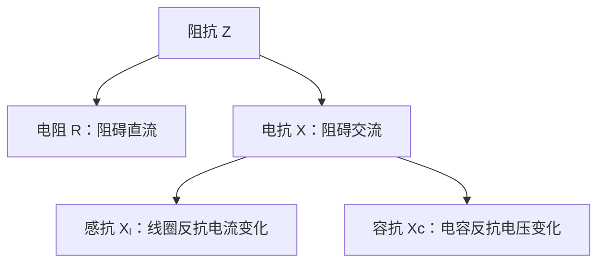
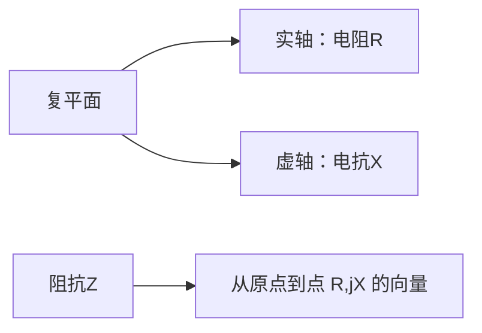






最近在学习电子设计，发现阻抗一词（impedance）出现得非常频繁，但之前在高中物理中却几乎没有涉及，因此决定写一篇笔记来整理一下阻抗相关的内容。

# 1. 写在前面：回顾电阻 (Resistance $R$)

> 电阻是导体对直流电的阻碍作用，其大小与导体的电阻率、长度和横截面积有关。

## 电阻概念的历史起源

电阻的概念可以追溯到19世纪初电学研究的早期。在1827年，德国物理学家格奥尔格·欧姆（Georg Ohm）通过一系列精巧的实验，发现了电压、电流和电阻之间的关系，这便是我们今天所熟知的欧姆定律。

欧姆的实验装置相对简单：他使用伏打电堆作为电源，通过不同长度的导线，并使用扭秤测量电流的磁效应（当时尚无直接的电流测量仪器）。通过系统地改变导线长度和材料，欧姆发现电流与电压成正比，与导线长度成反比，这一发现奠定了电路理论的基础。

## 电阻是什么

从微观角度看，电阻的本质源于**电子在导体中运动时与原子晶格（Lattice）的碰撞**。当电场施加在导体两端时，自由电子受到电场力的作用而定向移动，形成电流。然而，这种碰撞阻碍了电子的自由运动，从而产生了电阻效应。

电阻的单位是欧姆 (Ohm, $\Omega$)，其与电压和电流的关系为欧姆定律：

$$ V = IR \tag{1.1} $$

其中 $V$ 是电压，$I$ 是电流，$R$ 是电阻。

## 电阻的影响因素

电阻值的大小取决于以下几个因素：

1. **材料特性**：不同材料的电阻率不同，如银、铜、铝等良导体的电阻率较低，而橡胶、玻璃等绝缘体的电阻率极高。
2. **几何形状**：电阻与导体的长度成正比，与横截面积成反比，这一关系可表示为：

   $$ R = \rho \frac{L}{A} \tag{1.2}$$

   其中 $\rho$ 是电阻率，$L$ 是长度，$A$ 是横截面积。
3. **温度**：对于大多数金属导体，电阻随温度升高而增大（由于晶格振动加剧导致电子碰撞变得更加频繁）；而对于半导体和电解质，电阻可能随温度升高而减小。

在理想情况下，电阻值不随电压或电流的变化而变化，这种电阻称为线性电阻。然而，在实际应用中，许多元件的电阻会随工作条件的变化而改变。

电阻的概念为我们理解电路中的能量耗散提供了基础，但它只描述了电路行为的一个方面。当我们从直流电转向交流电时，电路的行为变得更加复杂，我们需要引入新的概念来全面描述电路的特性。

# 2. 从直流到交流：电路行为的演变

## 直流电 (DC) 的特性

直流电（Direct Current, DC）是我们最先接触的电学概念。在直流电路中，电流的大小和方向保持恒定，不会随时间变化。这种稳定性使得直流电路的分析相对简单，欧姆定律足以描述大多数情况下的电路行为。

直流电的特点：

- 电流方向恒定
- 电流大小恒定
- 只需考虑电阻对电流的阻碍作用
- 能量主要以热能形式消耗在电阻上

## 交流电 (AC) 的复杂性

交流电（Alternating Current, AC）则完全不同，它的大小和方向随时间周期性变化。最常见的交流电是正弦波交流电，其数学表达式为：

$$ I(t) = I_0 \sin(\omega t + \phi) \tag{2.1} $$

其中 $I_0$ 是电流幅值，$\omega$ 是角频率，$t$ 是时间，$\phi$ 是初相位。

交流电的引入使电路分析变得复杂，因为：

1. **时变性**：电压和电流随时间变化，需要考虑瞬时值和有效值
2. **方向性**：电流方向周期性反转，改变了电磁场的分布
3. **频率依赖性**：电路元件的行为随频率变化而不同
4. **相位关系**：电压和电流之间可能出现相位差

## 交流电中的特殊现象

在交流电路中，我们观察到了一些直流电路中不存在的现象：

1. **电磁感应**：变化的电流产生变化的磁场，进而产生感应电动势
2. **电容效应**：变化的电压导致电容器极板上的电荷积累和释放
3. **趋肤效应**：高频电流倾向于在导体表面流动，有效横截面积减小
4. **辐射效应**：高频交流电会以电磁波形式辐射能量

这些现象的出现，使得简单的欧姆定律不再足以描述交流电路中的全部行为。我们需要引入更复杂的概念——阻抗，来全面描述交流电路中的电压-电流关系。

然而，在深入探讨阻抗概念之前，我们需要先了解交流电路中的两个关键元件：电感和电容。正是这两个元件的存在，使得交流电路表现出与直流电路完全不同的特性，也使得阻抗概念变得必要。

# 3. 电感与电容：交流电路中的特殊元件

## 电感的物理原理

电感（Inductance）是电路中一种重要的储能元件，它的存在源于电磁感应现象。1831年，英国科学家迈克尔·法拉第（Michael Faraday）发现了电磁感应定律，为电感现象奠定了理论基础。

### 电感的物理本质

> 自感现象：当电流通过导体时，会在导体周围产生磁场。如果电流发生变化，磁场也会随之变化，这种变化的磁场会在导体中产生感应电动势，这个感应电动势的方向总是阻碍电流的变化。

电感的数学表达式为：

$$ V_L = L \frac{\mathrm dI}{\mathrm dt} \tag{3.1} $$

其中 $v_L$ 是电感两端的电压，$L$ 是电感量，$\frac{\mathrm dI}{\mathrm dt}$ 是电流变化率。

这个公式告诉我们，由于自感现象，电感两端的电压与电流的变化率成正比，而不是与电流本身成正比。这正是电感与电阻的根本区别：**电阻阻碍电流的流动，而电感阻碍电流的变化**。

如果电阻对应物理世界中的摩擦力，那么电感则对应于物理世界中带有惯性（inertia）的物体。电感元件在电路中储存和释放能量，其能量形式为磁场能。

### 电感在交流电路中的行为

在交流电路中，电流随时间正弦变化：

$$ I(t) = I_0 \sin(\omega t) \tag{3.2} $$

根据电感的电压公式 $(3.1)$，我们可以得到：

$$ V_L(t) = L \cdot \frac{\mathrm d}{\mathrm dt}[I_0 \sin(\omega t)] = L \cdot \omega I_0 \cos(\omega t) = \omega L I_0 \sin\left(\omega t + \frac{\pi}{2}\right) \tag{3.3} $$

这表明电感两端的电压超前电流 $\dfrac{\pi}{2}$。这种相位差是交流电路中电感的特征行为。

电感对交流电的阻碍作用称为感抗（Inductive Reactance），其大小为：

$$ X_L = \omega L = 2\pi fL \tag{3.4} $$

感抗随频率的增加而增加，因此电感对高频信号的阻碍作用更强

## 电容的物理原理

电容（Capacitance）是另一种重要的储能元件，它的历史可以追溯到18世纪中叶，当时荷兰科学家彼得·范·穆森布鲁克（Pieter van Musschenbroek）发明了莱顿瓶，这是最早的电容器。

### 电容的物理本质

电容是由两个相互绝缘的导体（极板）组成的系统。当在两极板间施加电压时，正电荷会聚集在一个极板上，负电荷会聚集在另一个极板上，形成电场。

电容的定义为：

$$ C = \frac{Q}{V} \tag{3.5} $$

其中 $C$ 是电容量，$Q$ 是极板上的电荷量，$V$ 是两极板间的电压

电容的 $I-V$ 关系为：

$$ I_C = C \frac{\mathrm dV}{\mathrm dt} \tag{3.6} $$

这表明电容中的电流与电压的变化率成正比，即充放电过程，而不是与电压本身成正比。这是电容与电阻的根本区别。

如果将电阻比作物理世界中的摩擦力，那么电容则对应于物理世界中的弹性（elasticity）。电容元件在电路中储存和释放能量，其能量形式为电场能

### 电容在交流电路中的行为

在交流电路中，电压随时间正弦变化：

$$ V(t) = V_0 \sin(\omega t) \tag{3.7} $$

根据电容的电流公式，我们可以得到：

$$ I_C(t) = C \frac{\mathrm d}{\mathrm dt}[V_0 \sin(\omega t)] = C \cdot \omega  V_0 \cos(\omega t) = \omega C V_0 \sin\left(\omega t + \frac{\pi}{2}\right) \tag{3.8} $$

这表明电容中的电流超前电压 $\dfrac{\pi}{2}$，与电感的情况正好相反。

电容对交流电的阻碍作用称为容抗（Capacitive Reactance），其大小为：

$$ X_C = \frac{1}{\omega C} = \frac{1}{2\pi fC} \tag{3.9}$$

容抗随频率的增加而减小，因此**电容对高频信号的阻碍作用较弱，对低频信号的阻碍作用较强**。

## 电感与电容的对比

| 特性 | 电感 | 电容 |
|------|------|------|
| 储能形式 | 磁场能 | 电场能 |
| 电压-电流关系 | $V_L = L \dfrac{\mathrm dI}{\mathrm dt}$ | $I_C = C \dfrac{\mathrm dV}{\mathrm dt}$ |
| 相位关系 | 电压超前电流 $\dfrac{\pi}{2}$ | 电流超前电压 $\dfrac{\pi}{2}$ |
| 频率特性 | 感抗随频率增加而增加 | 容抗随频率增加而减小 |
| 直流特性 | 对直流相当于短路 | 对直流相当于开路 |

电感和电容的这些特性，使它们在交流电路中表现出与电阻完全不同的行为，也为我们理解阻抗概念奠定了基础。

现在我们已经了解了电阻、电感和电容的基本特性，是时候将它们统一在一个框架下了。阻抗概念正是为了描述这些元件在交流电路中的综合行为而引入的，它不仅包含了能量耗散，也包含了能量存储和相位关系。

# 4. 关于阻抗：电阻，但不只是电阻

## 什么是阻抗 (Impedance $Z$) ？

> 阻抗（Electrical Impedance）又称电阻抗，是电路中电阻、电感、电容对交流电的阻碍作用的统称
>
> \- From [wikipedia](https://zh.wikipedia.org/zh/阻抗)

阻抗由以下部份组成：

$$ Z = R + jX $$

$$X_l = 2\pi fL$$

$$X_c = \frac{1}{2\pi fC}$$

## 阻抗的数学推导与复数表示

### 时域与频域：两种不同的视角

在深入探讨阻抗的数学表示之前，我们需要理解两个重要的概念：时域和频域。这两个概念为我们提供了分析电路的两种不同视角，每种视角都有其独特的优势。

#### 什么是时域？

时域是我们最熟悉的视角，它描述信号如何随时间变化。在时域中，我们观察的是电压、电流等物理量在每一时刻的值。就像我们用秒表记录运动物体的位置一样，时域分析关注的是"在时间t时刻，信号值是多少"。

在之前的章节中，我们已经接触了时域的表示方法。例如，交流电的电流可以表示为：

$$ I(t) = I_0 \sin(\omega t + \phi) $$

这个公式告诉我们，在任何时刻 $t$，电流的值是多少。时域分析的优点是直观、易于理解，因为我们日常经验就是基于时间的。

然而，时域分析也有其局限性。当电路中包含电感和电容时，我们需要处理微分方程，这使得计算变得复杂。此外，时域分析难以直接看出电路对不同频率信号的响应特性。

#### 什么是频域？

频域是另一种视角，它描述信号包含哪些频率成分，以及每个频率成分的强度和相位。如果说时域关注的是"信号在时间上如何变化"，那么频域关注的是"信号由哪些频率组成"。

频域分析就像是用棱镜将白光分解成彩虹中的各种颜色。白光本身看起来是单一的，但实际上它包含了多种不同频率（颜色）的光。同样，一个复杂的时域信号也可以被分解为多个不同频率的正弦波的叠加。

频域分析的数学基础是傅里叶变换，它可以将时域信号转换为频域表示。对于我们常见的正弦波交流电，其频域表示非常简单：只在特定频率f处有一个幅值。

#### 为什么需要频域分析？

频域分析在交流电路分析中特别有用，原因如下：

1. **简化计算**：在频域中，微分运算变成了简单的乘法运算。例如，电感的电压-电流关系 $V_L = L \dfrac{\mathrm dI}{\mathrm dt}$ 在频域中变成了 $V = j\omega L I$，这是一个简单的代数方程。

2. **直观理解频率响应**：频域分析使我们能够直接看出电路对不同频率信号的响应。例如，我们可以一眼看出一个电路是低通滤波器、高通滤波器还是带通滤波器。

3. **统一分析框架**：频域分析为电阻、电感和电容提供了一个统一的分析框架，使我们能够用相同的方法处理这些不同的元件。

4. **简化复杂信号分析**：对于复杂的非正弦信号（如方波、三角波等），频域分析可以将它们分解为多个正弦波的叠加，然后分别分析每个频率成分通过电路的情况。

#### 时域与频域的对应关系

时域和频域是描述同一信号的两种不同方式，它们之间有着严格的数学对应关系。以下是几个常见信号的时域和频域对应关系：

| 信号类型 | 时域表示 | 频域表示 |
|---------|---------|---------|
| 直流信号 | 常数 | 只在频率0处有值 |
| 正弦波 | $A\sin(2\pi ft + \phi)$ | 只在频率f处有值，幅值为A，相位为$\phi$ |
| 方波 | 周期性方波 | 基频和奇次谐波 |
| 冲激信号 | 极短时间内的极大值 | 所有频率都有相同的幅值 |

#### 从时域到频域的转变

在交流电路分析中，我们经常需要在时域和频域之间转换。这种转换不仅是一种数学技巧，更是一种思维方式的转变。

例如，当我们分析一个RC低通滤波器时：

- 在时域中，我们需要解微分方程来找出输出电压随时间的变化
- 在频域中，我们只需要计算传递函数 $H(f) = \dfrac{1}{1 + j2\pi fRC}$，就能直接看出电路对不同频率信号的响应

这种从时域到频域的转变，使我们能够更深入地理解电路的行为特性，特别是对频率的选择性。

#### 频域分析的实际应用

频域分析在许多领域都有广泛应用：

1. **音频处理**：均衡器通过增强或衰减特定频率的信号来调整音质
2. **无线通信**：不同电台使用不同频率的信号进行广播
3. **图像处理**：图像可以通过傅里叶变换转换到频域进行处理
4. **振动分析**：机械系统的振动可以分解为不同频率的成分

通过理解时域和频域的概念，我们为学习阻抗的复数表示打下了坚实的基础。阻抗本质上是一个频域概念，它描述了电路对不同频率信号的响应特性。在接下来的内容中，我们将看到如何利用频域分析来简化交流电路的计算，并获得更深刻的物理洞察。

### 为什么需要复数？一个简单的引入

在之前的章节中，我们已经了解到交流电路中的电感和电容会导致电压和电流之间产生相位差。这种相位差使得交流电路的分析比直流电路复杂得多。为了简化这种复杂性，数学家们发现了复数这样一个非常强大的工具

### 复数基础回顾

在深入阻抗的复数表示之前，让我们先简单回顾一下复数的基本概念：

复数可以表示为 $a + jb$，其中：

- $a$ 是实部
- $b$ 是虚部
- $j$ 是虚数单位，满足 $j^2 = -1$

> 由于 $i$ 有时表示电流，电子学中常用 $j$ 表示虚数单位，即 $j^2 = -1$

复数可以在平面上表示，横轴是实轴，纵轴是虚轴。这种表示方法帮助我们直观地理解复数的运算。

### 欧拉公式

在交流电路分析中，我们面临一个挑战：如何简化微分方程的求解？18世纪瑞士数学家莱昂哈德·欧拉（Leonhard Euler）发现了一个被誉为"数学中最美公式"的欧拉公式：

$$ e^{j\theta} = \cos\theta + j\sin\theta \tag{4.1} $$

这个公式实际上建立了一个非常重要的桥梁：它将指数函数与三角函数联系了起来，这意味着我们可以用指数函数来表示 $\sin$ 和 $\cos$

$$ \sin(\omega t) = \text{Im}[e^{j\omega t}] \tag{4.2} $$

$$ \cos(\omega t) = \text{Re}[e^{j\omega t}] \tag{4.3} $$

使用欧拉公式将复数变换至形式，微分运算将会变得非常简单：

$$ \frac{\mathrm d}{\mathrm dt}e^{j\omega t} = j\omega e^{j\omega t} \tag{4.4} $$

### 复数表示法与相量：简化交流电路分析

#### 什么是相量？

在交流电路分析中，我们引入了相量（Phasor）的概念。相量可以理解为"旋转的箭头"，它是一个复数，表示正弦量的两个关键信息：幅值（大小）和相位（位置）。

相量的数学表示为：

$$ V = V_0 e^{j\phi_v} \tag{4.5} $$

$$ I = I_0 e^{j\phi_i} \tag{4.5} $$

其中 $V_0$ 和 $I_0$ 是幅值（箭头的长度），$\phi_v$ 和 $\phi_i$ 是初相位（箭头的初始角度）。

#### 相量如何简化电路分析？

使用相量表示法，我们可以将复杂的微分方程转换为简单的代数方程。让我们通过电感和电容的例子，一步一步地详细说明这个过程。

##### 电感的例子：从微分方程到代数方程=

在时域中，电感的电压-电流关系是一个微分方程：

$$ V_L(t) = L \frac{\mathrm dI_L(t)}{\mathrm dt} \tag{4.6}  $$

这个方程告诉我们，电感两端的电压与电流的变化率成正比。如果我们知道电流的具体形式，可以通过求导得到电压。

让我们假设通过电感的电流是一个正弦波：

$$ I_L(t) = I_0 \sin(\omega t + \phi_i) \tag{4.7} $$

其中：

- $I_0$ 是电流的幅值（最大值）
- $\omega$ 是角频率（$\omega = 2\pi f$，$f$ 是频率）
- $t$ 是时间
- $\phi_i$ 是初相位（决定电流在 $t=0$ 时的值）

如果我们直接在时域中求解，需要将方程 $(4.7)$ 代入方程 $(4.6)$：

$$ V_L(t) = L \frac{\mathrm d}{\mathrm dt}[I_0 \sin(\omega t + \phi_i)] $$

求导得到：

$$ V_L(t) = L \cdot I_0 \omega \cos(\omega t + \phi_i) \tag{4.8} $$

利用三角恒等式 $\cos\theta = \sin(\theta + \dfrac{\pi}{2})$，我们可以将方程(3)改写为：

$$ V_L(t) = L \cdot I_0 \omega \sin(\omega t + \phi_i + \frac{\pi}{2}) \tag{4.9} $$

这个结果表明，电感两端的电压也是一个正弦波，但相位超前电流 $\dfrac{\pi}{2}$

现在，让我们看看如何使用相量表示法来简化这个过程。首先，我们需要将正弦函数表示为复指数函数的虚部。

根据欧拉公式：$e^{j\theta} = \cos\theta + j\sin\theta$，我们有：

$$ \sin\theta = \text{Im}[e^{j\theta}] $$

因此，方程 $(4.7)$ 可以表示为：

$$ I_L(t) = I_0 \sin(\omega t + \phi_i) = \text{Im}[I_0 e^{j(\omega t + \phi_i)}] = \text{Im}[I_0 e^{j\phi_i} e^{j\omega t}] \tag{4.10} $$

在相量表示法中，我们定义电流相量 $I$ 为：

$$ I = I_0 e^{j\phi_i} \tag{4.11} $$

因此，方程 $(4.10)$ 可以写为：

$$ I_L(t) = \text{Im}[I e^{j\omega t}] \tag{4.12} $$

现在，让我们对方程 $(4.12)$ 两边求导：

$$ \frac{\mathrm dI_L(t)}{\mathrm dt} = \frac{\mathrm d}{\mathrm dt}\text{Im}[I e^{j\omega t}] = \text{Im}\left[\frac{\mathrm d}{\mathrm dt}(I e^{j\omega t})\right] $$

因为 $I$ 是一个常数（不随时间变化），所以：

$$ \frac{\mathrm dI_L(t)}{\mathrm dt} = \text{Im}[I \cdot \frac{\mathrm d}{\mathrm dt}e^{j\omega t}] = \text{Im}[I \cdot j\omega e^{j\omega t}] = \text{Im}[j\omega I e^{j\omega t}] \tag{4.13} $$

将方程 $(4.13)$ 代入电感的电压方程 $(4.6)$：

$$ V_L(t) = L \cdot \text{Im}[j\omega I e^{j\omega t}] = \text{Im}[j\omega L I e^{j\omega t}] \tag{4.14} $$

这表明电压的相量表示为：

$$ V = j\omega L I \tag{4.15} $$

从方程 $(4.15)$，我们可以定义电感的阻抗为：

$$ Z_L = \frac{V}{I} = j\omega L \tag{4.16} $$

这个结果告诉我们，在相量表示法中，电感的阻抗是一个纯虚数 $j\omega L$。现在让我们验证一下这个结果是否与直接求解的结果一致。从方程(10)和(6)，我们有：

$$ V = j\omega L I = j\omega L I_0 e^{j\phi_i} = \omega L I_0 e^{j(\phi_i + \frac{\pi}{2})} \tag{4.17} $$

因为 $j = e^{j\frac{\pi}{2}}$，所以 $j\omega L I_0 e^{j\phi_i} = \omega L I_0 e^{j(\phi_i + \frac{\pi}{2})}$。

将方程 $(4.17)$ 转换回时域：

$$ V_L(t) = \text{Im}\left[V e^{j\omega t}\right] = \text{Im}\left[\omega L I_0 e^{j(\phi_i + \frac{\pi}{2})} e^{j\omega t}\right] = \omega L I_0 \sin\left(\omega t + \phi_i + \frac{\pi}{2}\right) $$

这与我们直接求解得到的方程 $(4.9)$ 完全一致，验证了相量表示法的正确性。

#### 电容的例子

在时域中，电容的电流-电压关系是：

$$ I_C(t) = C \frac{\mathrm dV_C(t)}{\mathrm dt} \tag{4.18} $$

假设电容两端的电压是一个正弦波：

$$ V_C(t) = V_0 \sin(\omega t + \phi_v) \tag{4.19} $$

将方程 $(4.19)$ 代入方程 $(4.18)$：

$$ I_C(t) = C \frac{\mathrm d}{\mathrm dt}[V_0 \sin(\omega t + \phi_v)] = C \cdot V_0 \omega \cos(\omega t + \phi_v) $$

利用三角恒等式，可以改写为：

$$ I_C(t) = C \cdot V_0 \omega \sin\left(\omega t + \phi_v + \frac{\pi}{2}\right) \tag{4.20} $$

这表明，电容中的电流超前电压 $\dfrac{\pi}{2}$。

将方程 $(4.19)$ 表示为复指数函数的虚部：

$$ V_C(t) = V_0 \sin(\omega t + \phi_v) = \text{Im}[V_0 e^{j(\omega t + \phi_v)}] = \text{Im}[V_0 e^{j\phi_v} e^{j\omega t}] \tag{4.21} $$

定义电压相量 $V$ 为：

$$ V = V_0 e^{j\phi_v} \tag{4.22} $$

因此，方程 $(4.20)$ 可以写为：

$$ V_C(t) = \text{Im}[V e^{j\omega t}] \tag{4.23} $$

对方程 $(4.22)$ 两边求导：

$$ \frac{\mathrm dV_C(t)}{\mathrm dt} = \frac{\mathrm d}{\mathrm dt}\text{Im}\left[V e^{j\omega t}\right] = \text{Im}\left[\frac{\mathrm d}{\mathrm dt}(V e^{j\omega t})\right] = \text{Im}\left[V \cdot j\omega e^{j\omega t}\right] = \text{Im}[j\omega V e^{j\omega t}] \tag{4.24} $$

将方程 $(4.24)$ 代入电容的电流方程 $(4.18)$：

$$ I_C(t) = C \cdot \text{Im}[j\omega V e^{j\omega t}] = \text{Im}[j\omega C V e^{j\omega t}] \tag{4.25} $$

这表明电流的相量表示为：

$$ I = j\omega C V \tag{4.26} $$

从方程 $(4.26)$，我们可以解出 $V$：

$$ V = \frac{1}{j\omega C} I \tag{4.27} $$

因此，电容的阻抗为：

$$ Z_C = \frac{V}{I} = \frac{1}{j\omega C} \tag{4.28} $$

我们可以进一步简化方程 $(4.28)$。首先，注意到：

$$ \frac{1}{j} = \frac{j}{j \cdot j} = \frac{j}{-1} = -j $$

因此，电容的阻抗可以写为：

$$ Z_C = -j\frac{1}{\omega C} \tag{4.29} $$

让我们验证一下这个结果是否与直接求解的结果一致。从方程 $(4.27)$ 和 $(4.22)$，我们有：

$$ I = j\omega C V = j\omega C V_0 e^{j\phi_v} = \omega C V_0 e^{j(\phi_v + \frac{\pi}{2})} \tag{4.30} $$

将方程 $(4.20)$ 转换回时域：

$$ I_C(t) = \text{Im}[I e^{j\omega t}] = \text{Im}[\omega C V_0 e^{j(\phi_v + \frac{\pi}{2})} e^{j\omega t}] = \omega C V_0 \sin(\omega t + \phi_v + \frac{\pi}{2}) $$

这与我们直接求解得到的方程 $(4.20)$ 完全一致，验证了相量表示法的正确性。

#### 相量表示法的优势

通过相量表示法，我们将微分方程转换为代数方程，大大简化了计算过程，同时相量的旋转特性帮助我们直观地理解交流电的相位关系，这为电阻、电感和电容提供了一个统一的分析框架，也使他们可以在复平面上绘制电压和电流的关系

## 阻抗的复数表示：统一的电路描述

### 阻抗的复数形式

现在，我们可以将前面学到的知识整合起来，给出阻抗的复数表示：

$$ Z = R + jX \tag{4.31}$$

其中：

- $R$ 是电阻（实部），代表能量耗散
- $X$ 是电抗（虚部），代表能量存储
- $j$ 是虚数单位

这个复数形式完美地统一了电阻、电感和电容的特性：

- 对于纯电阻：$Z = R$（只有实部）
- 对于纯电感：$Z = j\omega L$（只有虚部，为正）
- 对于纯电容：$Z = -j\dfrac{1}{\omega C}$（只有虚部，为负）

### 阻抗的几何解释

阻抗也可以在复平面上表示，这为我们提供了直观的几何理解：

阻抗的极坐标形式为：

$$ Z = |Z| e^{j\theta} \tag{4.32} $$

其中：

- $\|Z\| = \sqrt{R^2 + X^2}$ 是阻抗的模，表示电路对交流电的总阻碍作用
- $\theta = \arctan\left(\dfrac{X}{R}\right)$ 是阻抗的相位角，表示电压与电流之间的相位差

**物理意义**：

- 阻抗的模 $\|Z\|$ 类似于电阻的大小，但它不仅考虑了能量耗散，还考虑了能量存储效应。
- 相位角 $\theta$ 告诉我们电压超前电流多少角度：
  - 如果 $\theta > 0$，电压超前电流（电路呈感性）
  - 如果 $\theta < 0$，电压滞后电流（电路呈容性）
  - 如果 $\theta = 0$，电压与电流同相（电路呈纯阻性）

### 从复数阻抗到欧姆定律

有了复数阻抗的概念，我们可以将欧姆定律推广到交流电路：

$$ V = Z \cdot I \tag{4.33} $$

这个形式与直流电路中的欧姆定律 $V = R \cdot I$ 非常相似，但这里的 $V$ 和 $I$ 是相量，$Z$ 是复数阻抗。这种统一的形式大大简化了交流电路的分析！

## 阻抗的串联与并联：电路分析的实用工具

### 阻抗的串联

当多个阻抗串联时，总阻抗等于各阻抗之和。这与电阻的串联规则完全相同：

**串联**：总阻抗等于各阻抗之和

$$ Z_{total} = Z_1 + Z_2 + \cdots + Z_n \tag{4.34}$$

**例子**：一个电阻 $R$ 和一个电感 $L$ 串联

$$ Z_{total} = R + j\omega L $$

这个结果的物理意义是：电路中既有能量耗散（电阻部分），又有能量存储（电感部分），且电压超前电流。

### 阻抗的并联

当多个阻抗并联时，总阻抗的倒数等于各阻抗倒数之和。这也与电阻的并联规则相同：

**并联**：总阻抗的倒数等于各阻抗倒数之和

$$ \frac{1}{Z_{total}} = \frac{1}{Z_1} + \frac{1}{Z_2} + \cdots + \frac{1}{Z_n} \tag{4.35}$$

**例子**：一个电阻 $R$ 和一个电容 $C$ 并联

$$ \frac{1}{Z_{total}} = \frac{1}{R} + \frac{1}{-j\frac{1}{\omega C}} = \frac{1}{R} + j\omega C$$

因此，

$$ Z_{total} = \frac{1}{\frac{1}{R} + j\omega C} = \frac{R}{1 + j\omega RC}$$

这个结果表明，并联RC电路的阻抗是一个复数，其实部和虚部都与频率有关。

### 实际应用：为什么这些规则很重要？

阻抗的串联和并联规则在实际电路设计中非常重要，因为：

1. **电路分析**：这些规则允许我们分析复杂的交流电路，将多个元件简化为一个等效阻抗。
2. **滤波器设计**：通过串联和并联不同的元件，可以设计出具有特定频率响应的滤波器。
3. **阻抗匹配**：在信号传输中，需要匹配源阻抗和负载阻抗，以最大化功率传输或最小化反射。
4. **谐振电路**：通过串联或并联电感和电容，可以创建在特定频率下具有特殊行为的谐振电路。

这些规则与直流电路中的电阻串联和并联规则形式相同，这使得我们可以将直流电路的分析方法直接推广到交流电路，大大简化了学习过程！

## 阻抗与导纳：两种互补的视角

### 什么是导纳？

导纳（Admittance）是阻抗的倒数，用 $Y$ 表示：

$$ Y = \frac{1}{Z} = G + jB \tag{4.36}$$

其中：

- $G$ 是电导（实部），是电阻的倒数
- $B$ 是电纳（虚部），是电抗的倒数

**为什么需要导纳？**

导纳的概念为我们提供了分析电路的另一种视角。如果说阻抗描述了电路对电流的"阻碍"程度，那么导纳则描述了电路对电流的"导通"程度。

在某些情况下，特别是分析并联电路时，使用导纳比使用阻抗更加方便。因为并联导纳可以直接相加，就像并联电阻的电导可以直接相加一样。

### 阻抗与导纳的转换

让我们看看如何将阻抗转换为导纳：

给定阻抗 $Z = R + jX$，其导纳为：

$$ Y = \frac{1}{Z} = \frac{1}{R + jX} $$

为了将分母中的虚数消除，我们可以将分子和分母同时乘以 $R - jX$：

$$ Y = \frac{R - jX}{(R + jX)(R - jX)} = \frac{R - jX}{R^2 + X^2} = \frac{R}{R^2 + X^2} - j\frac{X}{R^2 + X^2} \tag{4.37}$$

因此，

$$ G = \frac{R}{R^2 + X^2} \tag{4.38}$$
$$ B = -\frac{X}{R^2 + X^2} \tag{4.39}$$

**例子**：电感的导纳

电感的阻抗为 $Z_L = j\omega L$，其导纳为：

$$ Y_L = \frac{1}{j\omega L} = -j\frac{1}{\omega L} $$

这表明电感的导纳是一个纯虚数，且为负值。

### 导纳的实际应用

导纳的概念在以下几种情况下特别有用：

1. **并联电路分析**：当多个元件并联时，总导纳等于各导纳之和：
   $$ Y_{total} = Y_1 + Y_2 + \cdots + Y_n \tag{4.40}$$
   这比计算并联阻抗要简单得多。

2. **节点分析法**：在电路理论中，节点分析法使用导纳而不是阻抗，可以简化方程的建立。

3. **传输线理论**：在分析高频信号传输时，导纳是一个基本概念。

4. **网络分析**：在分析复杂网络时，导纳矩阵比阻抗矩阵更容易处理。

### 阻抗与导纳的对比

| 特性 | 阻抗 $Z$ | 导纳 $Y$ |
|------|---------|---------|
| 定义 | 电压与电流之比 | 电流与电压之比 |
| 单位 | 欧姆 ($\Omega$) | 西门子 (S) |
| 串联 | 直接相加 | 需要转换 |
| 并联 | 需要转换 | 直接相加 |
| 物理意义 | 对电流的阻碍 | 对电流的导通 |

阻抗和导纳是描述电路特性的两种互补方法。在实际问题中，我们可以根据具体情况选择使用阻抗还是导纳，以简化计算和分析过程。

## 阻抗的物理意义：从数学到现实

阻抗的复数表示不仅仅是一个抽象的数学工具，它有着深刻的物理意义。让我们从不同角度来理解阻抗的物理含义。

### 能量视角：耗散与存储

从能量的角度看，阻抗的复数形式完美地描述了电路中能量的两种不同命运：

1. **实部（电阻）**：代表能量耗散
   - 当电流通过电阻时，电能被不可逆地转化为热能
   - 这种能量转化是不可逆的，符合热力学第二定律
   - 电阻越大，能量耗散越快

2. **虚部（电抗）**：代表能量存储
   - 在电感中，能量以磁场形式存储
   - 在电容中，能量以电场形式存储
   - 这种能量存储是可逆的，可以被完全释放回电路
   - 电抗的大小决定了能量存储的效率

### 时间视角：即时与延迟

从时间的角度看，阻抗描述了电压和电流之间的时间关系：

1. **纯电阻电路**：电压和电流同步变化，没有时间延迟
2. **电感电路**：电压变化超前于电流变化，电感"抵抗"电流的变化
3. **电容电路**：电流变化超前于电压变化，电容"抵抗"电压的变化

### 频率视角：通与阻

从频率的角度看，阻抗描述了电路对不同频率信号的不同响应：

1. **电阻**：对所有频率的信号响应相同
2. **电感**：对高频信号阻碍大，对低频信号阻碍小
3. **电容**：对低频信号阻碍大，对高频信号阻碍小

这种频率选择性是许多电子电路（如滤波器、谐振电路）的基础。

### 几何视角：向量与旋转

从几何的角度看，阻抗可以在复平面上表示为一个向量：

1. **模**：向量的长度，表示电路对交流电的总阻碍作用
2. **相位角**：向量与实轴的夹角，表示电压与电流之间的相位关系

### 实用视角：简化与统一

从实用的角度看，阻抗的复数表示为我们提供了一个统一的分析框架：

1. **统一描述**：将电阻、电感和电容统一在一个数学框架下
2. **简化计算**：将微分方程转换为代数方程，大大简化了计算过程
3. **直观理解**：通过复数平面上的几何表示，提供了直观的理解方式
4. **广泛应用**：适用于从简单电路到复杂网络的各种情况

# 5. 阻抗的实际应用

## 滤波电路：频率选择性

阻抗的频率依赖性是许多电子电路的基础。滤波电路利用不同频率下阻抗的变化，实现对特定频率信号的选择性通过或阻断。

### 低通滤波器（Low-pass Filter）

一个简单的RC低通滤波器由一个电阻和一个电容串联组成：



> Schematic of a simple parallel LC circuit. From wikipedia, [Link](https://commons.wikimedia.org/wiki/File:Low_pass_filter.png)

该电路的传递函数为：

$$ H(f) = \frac{V_{out}}{V_{in}} = \frac{1}{1 + j2\pi fRC} \tag{5.1} $$

当频率 $f$ 很低时，电容的容抗 $X_C = \dfrac{1}{2\pi fC}$ 很大，相当于开路，信号几乎无衰减地通过。当频率 $f$ 很高时，容抗很小，相当于短路，信号被大幅衰减。

### 高通滤波器（High-pass Filter）

类似地，一个简单的高通滤波器可以通过交换电阻和电容的位置来实现：



> A high-pass filter. From wikipedia, [Link](https://commons.wikimedia.org/wiki/File:CR_high_pass_filter.svg)

该电路的传递函数为：

$$ H(f) = \frac{V_{out}}{V_{in}} = \frac{j2\pi fRC}{1 + j2\pi fRC} \tag{5.2} $$

这种滤波器允许高频信号通过，而阻断低频信号。

## 谐振电路（Resonant/LC Circuit）：能量交换的和谐

当电感和电容组合在一起时，会发生谐振现象。在谐振频率下，感抗和容抗相互抵消，电路呈现纯电阻特性。

### 串联谐振电路



> Schematic of a simple parallel LC circuit. From wikipedia, [Link](https://commons.wikimedia.org/wiki/File:LC_parallel_simple.svg)

串联谐振电路的总阻抗为：

$$ Z = R + j\left(\omega L - \frac{1}{\omega C}\right) \tag{5.3} $$

谐振频率 $\omega_0$ 满足 $\omega_0 L = \frac{1}{\omega_0 C}$，即：

$$ f_0 = \frac{1}{2\pi\sqrt{LC}} \tag{5.4} $$

在谐振频率下，阻抗达到最小值 $Z = R$，电流达到最大值。

## 阻抗匹配：最大功率传输

在电子系统中，阻抗匹配是一个重要概念。根据最大功率传输定理，当负载阻抗等于源阻抗的共轭复数时，负载可以获得最大功率。

对于纯电阻电路，这意味着负载电阻应等于源电阻。对于含有电抗的电路，负载阻抗应为源阻抗的共轭复数：

$$ Z_L = Z_S^* $$

这一原理在音频系统、射频电路和天线设计中都有重要应用。

## 实际应用

### 音频系统中的分频器

在音响系统中，分频器利用阻抗的频率特性，将音频信号分配到不同的扬声器：

- 低音扬声器：通过低通滤波器，接收低频信号
- 高音扬声器：通过高通滤波器，接收高频信号
- 中音扬声器：通过带通滤波器，接收中频信号

### 无线通信中的匹配网络

在无线通信系统中，天线阻抗通常为50Ω或75Ω，而放大器输出阻抗可能不同。为了实现最大功率传输，需要设计匹配网络，使天线阻抗与放大器输出阻抗匹配。

### 电力系统中的功率因数校正

在电力系统中，感性负载（如电动机）会导致电流滞后于电压，降低功率因数。通过并联适当的电容，可以补偿相位差，提高功率因数，减少能源浪费。

通过这些实际应用，我们可以看到阻抗概念不仅是一个抽象的物理概念，也是现代电子技术和电力系统的基础。

# 总结

## 笔记回顾

在这篇笔记中，我们经历了一个从简单到复杂、从具体到抽象的学习过程：

1. **从电阻开始**：我们首先回顾了电阻的概念，了解了它的历史起源、物理本质和影响因素。电阻作为电路中最基本的元件，为我们理解能量耗散提供了基础。

2. **进入交流世界**：接着，我们探讨了交流电与直流电的区别，认识到交流电路中出现的特殊现象，如电磁感应、电容效应等，这些现象使得简单的欧姆定律不再适用。

3. **认识特殊元件**：我们深入研究了电感和电容的物理原理，了解了它们在交流电路中的特殊行为，特别是它们与电阻的根本区别——电感和电容阻碍的是电流和电压的变化，而不是电流和电压本身。

4. **引入阻抗概念**：通过将电阻、感抗和容抗统一在一个复数框架下，我们引入了阻抗的概念。阻抗不仅包含了电路对交流电的阻碍作用，还包含了电压与电流之间的相位关系。

5. **数学工具的应用**：我们学习了如何使用复数和相量来简化交流电路的分析，将微分方程转换为代数方程，大大简化了计算过程。

6. **实践验证理论**：最后，我们通过实际应用案例和实验演示，验证了阻抗理论，并了解了它在现代电子技术中的广泛应用。

## 阻抗概念的深层意义

阻抗概念的重要性不仅在于它的实用性，还在于它体现了物理学中的一种重要思想：**统一与简化**。通过引入复数表示，我们能够将原本复杂的交流电路问题简化为类似于直流电路的问题，这种思想在物理学的发展史上反复出现。

阻抗概念也展示了物理学中**模型构建**的过程。面对复杂的自然现象，我们不是直接陷入细节，而是构建适当的数学模型，抓住主要矛盾，忽略次要因素，从而获得对问题的深入理解。

---
&ensp;

由我和 GLM-4.5 合作整理于2025年8月7日
